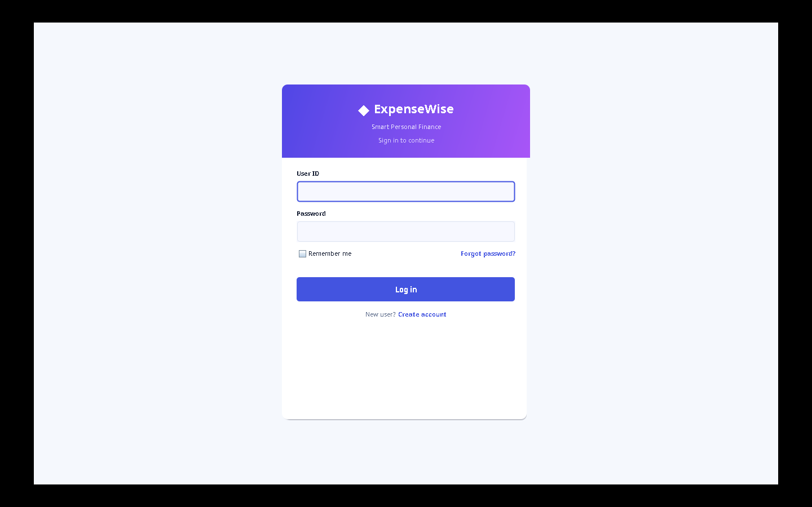
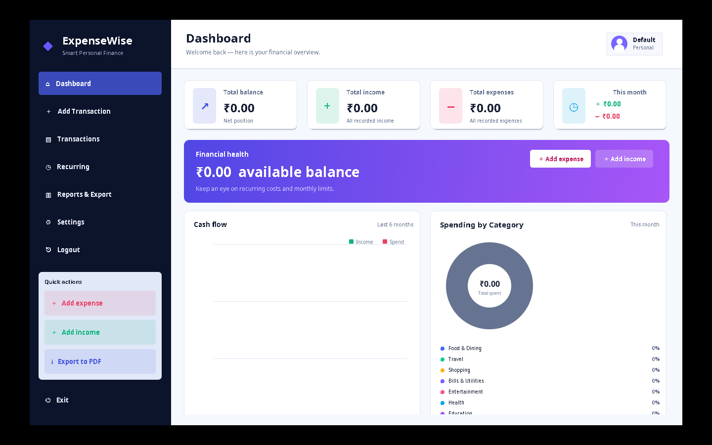
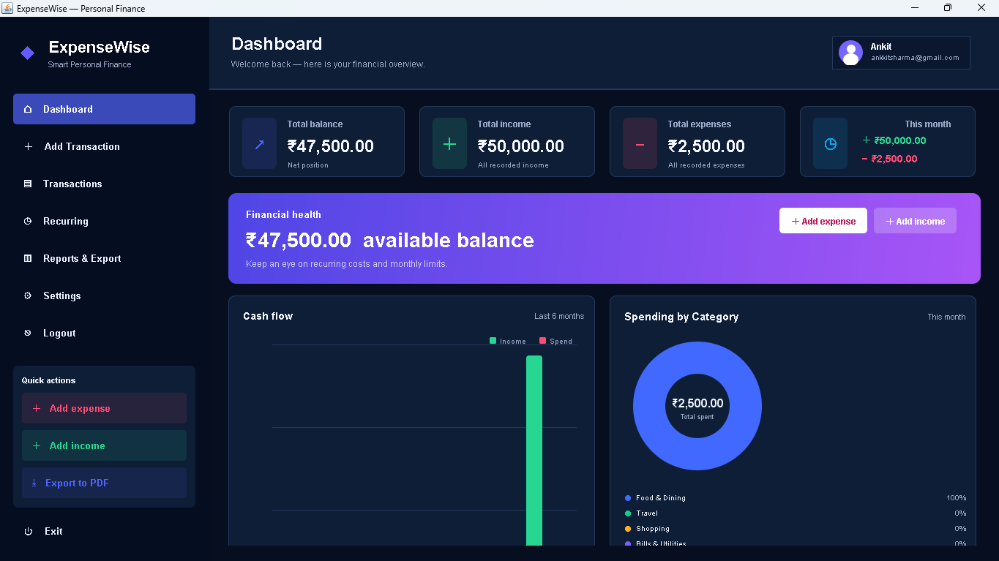
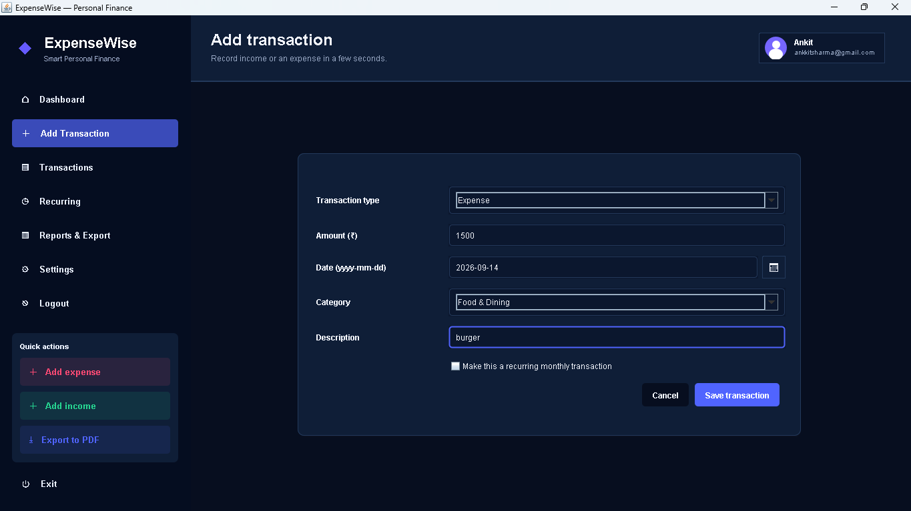
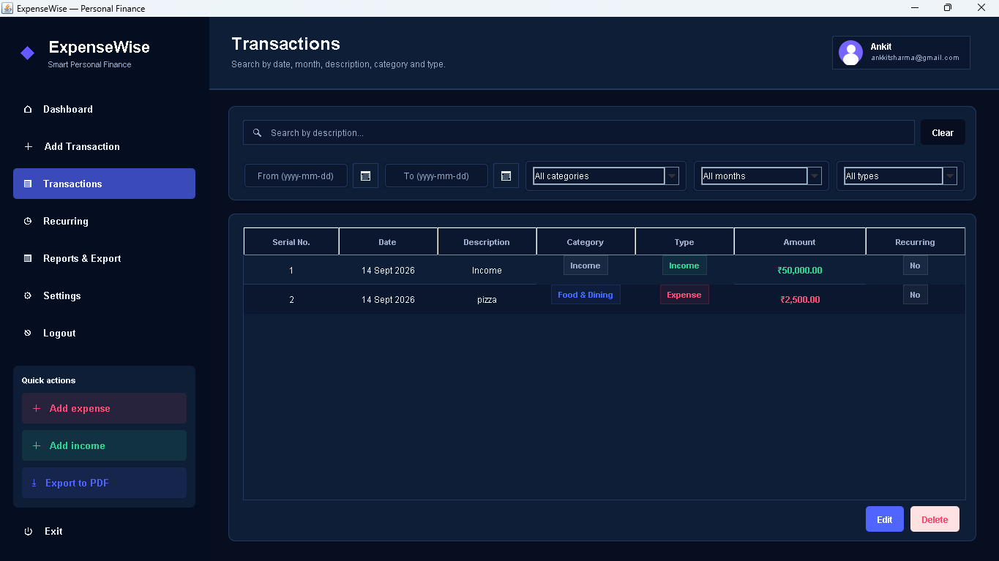
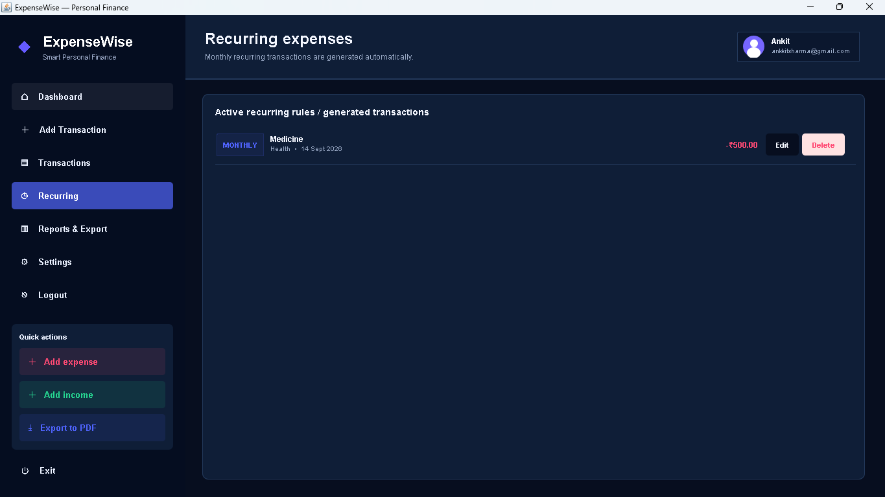
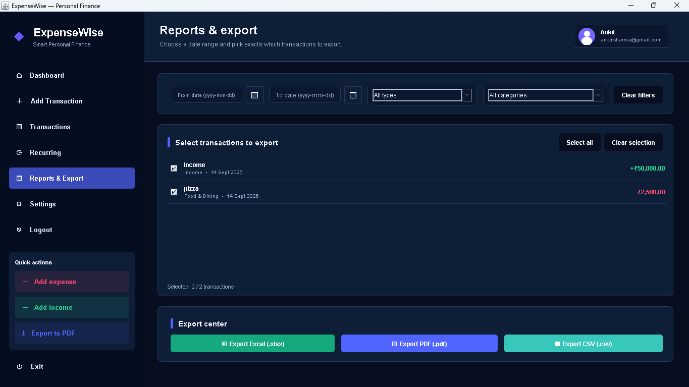
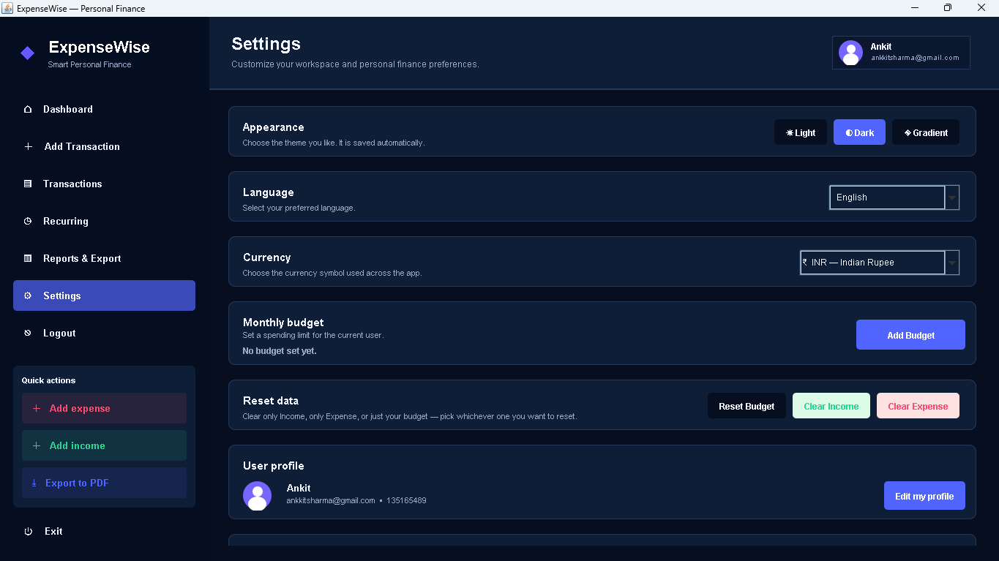
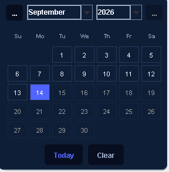
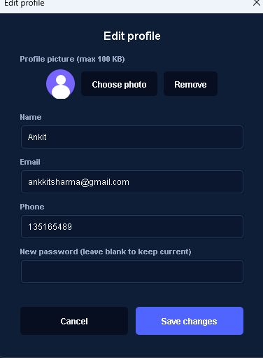

<div align="center">

# 💰 ExpenseWise

### Smart Personal Finance Manager built with Java Swing

A modern desktop application for tracking income, expenses, recurring transactions, budgets, reports, and personal finance data — with a polished dashboard, multiple themes, multilingual support, and local data storage.

<p>
  
  
  
  
</p>

<p>
  <a href="#-features">Features</a> •
  <a href="#-screenshots">Screenshots</a> •
  <a href="#-getting-started">Getting Started</a> •
  <a href="#-project-structure">Project Structure</a> •
  <a href="#-export-options">Export</a>
</p>

</div>

---

## 📌 About the Project

**ExpenseWise** is a Java Swing-based personal finance manager designed for simple, offline-first money management.

It lets users manage income and expenses, monitor budgets, create recurring transactions, review reports, customize their profile, change the application language and appearance, and export financial data.

The application stores its data locally on the user's computer, so no online database is required for normal use.

---

## ✨ Features

### 📊 Dashboard
- Total balance overview
- Income and expense summaries
- Current-month financial overview
- Cash-flow visualization
- Spending-by-category visualization
- Recent transactions
- Monthly budget progress
- Quick actions for adding transactions and exporting data

### 💳 Transaction Management
- Add income and expenses
- Transaction date and amount
- Description and category for expenses
- Multiple expense categories
- Edit transactions
- Delete transactions
- Undo recent deletion
- Search and filtering
- Filter by date, month, category and transaction type

### 🔁 Recurring Transactions
- Create recurring monthly transactions
- Automatically process recurring transactions when required
- Edit recurring transactions
- Delete recurring transactions

### 💰 Budget Management
- Set a monthly spending limit
- Track spending against the monthly budget
- Visual budget progress
- Budget status monitoring
- Reset budget when required

### 📈 Reports & Export
Export financial data locally in:
- 📄 PDF
- 📊 Excel `.xlsx`
- 🧾 CSV

### 🎨 Appearance
Choose between:
- ☀️ Light
- 🌙 Dark
- 🌈 Gradient

The selected appearance is saved in the application's preferences.

### 🌍 Languages
The application includes:
- 🇬🇧 English
- 🇮🇳 Hindi
- 🇪🇸 Spanish
- 🇫🇷 French
- 🇩🇪 German
- 🇯🇵 Japanese

### 💱 Currency Support
Includes commonly used currency symbols such as:
- ₹ Indian Rupee
- $ US Dollar
- € Euro
- £ British Pound
- ¥ Japanese Yen

### 👤 User Profiles
- Create user profiles
- Login/logout
- Remember-user option
- Email and phone profile information
- Profile photo support
- Edit profile
- Password change/reset flow
- Account deletion option

### 🖥️ Desktop UI
- Dashboard-style interface
- Sidebar navigation
- Responsive/collapsible navigation behavior
- Theme-aware interface
- Profile and settings customization

---

## 🖥️ Screenshots

All screenshots are stored in [`docs/screenshots/`](docs/screenshots/).

### 🔐 1. Login

<p align="center">
  
</p>

### ☀️ 2. Dashboard — Light Theme

<p align="center">
  
</p>

### 🌙 3. Dashboard — Dark Theme

<p align="center">
  
</p>

### ➕ 4. Add Transaction

<p align="center">
  
</p>

### 💳 5. Transactions

<p align="center">
  
</p>

### 🔁 6. Recurring Transactions

<p align="center">
  
</p>

### 📈 7. Reports

<p align="center">
  
</p>

### ⚙️ 8. Settings

<p align="center">
  
</p>

### 📅 9. Calendar

<p align="center">
  
</p>

### 👤 10. Edit Profile

<p align="center">
  
</p>

---

## 🛠️ Tech Stack

| Technology | Purpose |
|---|---|
| **Java 8+** | Core programming language |
| **Java Swing** | Desktop graphical user interface |
| **Java AWT** | UI drawing, events and desktop interaction |
| **Java NIO** | Local file handling and persistence |
| **Java ZIP APIs** | XLSX generation |
| **Java ImageIO** | Profile image handling |
| **Java Security APIs** | Password hashing |

### Dependencies

The project uses Java's standard libraries and does not require a third-party dependency manager for the core application.

---

## 🚀 Getting Started

### Prerequisites

Install **Java 8 or newer** and make sure both `java` and `javac` are available in your terminal.

Check your installation:

```bash
java -version
javac -version
```

### ▶️ Run on Windows

The repository includes a ready-to-use `run.bat` launcher.

#### Option 1 — Double-click

Open the project folder and double-click:

```text
run.bat
```

The script compiles `ExpenseWise.java` and starts the application.

#### Option 2 — Terminal

From the project directory:

```bat
run.bat
```

### 🧱 Compile and Run Manually

```bash
javac ExpenseWise.java
java ExpenseWise
```

---

## 📁 Project Structure

```text
Expense-Wise/
│
├── ExpenseWise.java
├── run.bat
├── README.md
├── .gitignore
│
└── docs/
    └── screenshots/
        ├── 01-login.png
        ├── 02-dashboard-light.png
        ├── 03-dashboard-dark.png
        ├── 04-add-transaction.png
        ├── 05-transactions.png
        ├── 06-recurring.png
        ├── 07-reports.png
        ├── 08-settings.png
        ├── 09-calendar.png
        └── 10-edit-profile.png
```

---

## 💾 Data Storage

ExpenseWise is designed as an **offline-first desktop application**.

Application data is stored locally under:

```text
~/.expensewise/
```

The application can maintain local transaction data, user information, preferences, budgets, profile details and profile images without requiring an online backend.

---

## 🔐 Privacy & Security

- Financial data is stored locally by the application.
- Passwords are processed using a hashing mechanism before storage.
- Normal application operation does not require a cloud database.
- Avoid committing personal/generated application data to the repository.
- Keep `.gitignore` enabled for generated files.

> **Production note:** For a real-world production system, use a password-specific hashing algorithm such as Argon2id, bcrypt or scrypt with proper salting, rate limiting and secure secret management.

---

## 📤 Export Options

| Format | Purpose |
|---|---|
| 📄 **PDF** | Printable and shareable reports |
| 📊 **Excel (.xlsx)** | Spreadsheet analysis |
| 🧾 **CSV** | Lightweight tabular data |

Exports are generated locally by the application.

---

## 🎯 Use Cases

ExpenseWise can be useful for:

- Personal expense tracking
- Student finance management
- Monthly budget planning
- Household spending records
- Personal financial reports
- Learning Java Swing and desktop application development

---

## 🔮 Future Improvements

Possible future upgrades include:

- ☁️ Cloud backup and synchronization
- 🗄️ MySQL/PostgreSQL database support
- 📱 Mobile companion application
- 📊 More advanced financial analytics
- 🧾 Receipt image attachments
- 💾 Automatic backup and restore
- 🔒 Encrypted local storage
- 🔔 Budget notifications
- 📥 Data import functionality
- 🎯 Savings goals and financial planning

---

## 🤝 Contributing

Contributions, ideas and improvements are welcome.

```bash
git checkout -b feature/my-improvement
git add .
git commit -m "Add my improvement"
git push origin feature/my-improvement
```

Then open a Pull Request on GitHub.

---

## 📄 License

This project is currently intended for **personal / educational use**.

---

## 👨‍💻 Author

**Ankit Kumar**

Built with ❤️ using **Java Swing**.

---

<div align="center">

### 💰 ExpenseWise — Track. Analyze. Manage.

⭐ If you find ExpenseWise useful, consider giving the repository a star!

</div>
